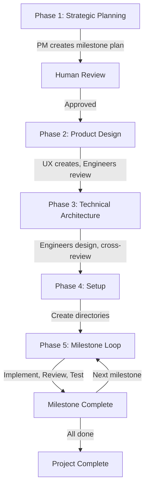

# Orchestration Quick Reference

## Phase Flow



## Directory Structure Cheatsheet

```
project/
├── docs/                    # Initial PRD
├── odyssey/                 # Master plans (READ-ONLY after Phase 3)
│   ├── milestone-plan.md    # High-level breakdown
│   ├── design/             # Product designs
│   └── architecture/       # System design
├── coordination/           
│   └── milestone-X/        # Active work
│       ├── specs/          # Detailed designs
│       ├── implementations/# Post-implementation docs
│       └── progress/       # Daily updates
└── [code]/                 # Actual implementation
```

## Agent Responsibilities by Phase

### Phase 1: Strategic Planning
- **Product-Manager**: Create milestone plan from PRD
- **Others**: Wait

### Phase 2: Product Design  
- **UX-Designer**: Create designs and mockups
- **All Engineers**: Review and provide feedback
- **Product-Manager**: Facilitate review

### Phase 3: Technical Architecture
- **All Engineers**: Create domain architectures
- **Bar-Raiser**: Architecture review
- **Security-Engineer**: Security review

### Phase 4: Setup
- **Orchestrator**: Create milestone directories

### Phase 5: Milestone Implementation
- **Product-Manager**: Detailed requirements
- **UX-Designer**: UI specifications  
- **Engineers**: Technical design → Implementation → Testing
- **Bar-Raiser**: Code review
- **Security-Engineer**: Security review
- **QA-Engineer**: E2E testing

## Pull Model Operation

### How Agents Work
1. **Agents Monitor Status Files** - Each agent regularly checks:
   - `odyssey/status/phase-status.md` - For phase transitions
   - `coordination/milestone-X/status.md` - For task assignments

2. **Agents Act When Ready** - When an agent sees their tasks marked as ready:
   - They read necessary input files
   - Complete their work
   - Update status checkboxes
   - Move to next task

3. **No Manual Coordination** - The status files drive everything:
   - Agents pull work when ready
   - No need to manually notify agents
   - Status updates trigger next actions

### Status File Example
```markdown
## Phase 2: Product Design
- [x] UX-Designer assigned
- [x] UX-Designer read PRD and milestone plan
- [x] Design system created
- [ ] All engineers have reviewed designs:  ← Engineers see this and know to review
  - [ ] Backend-Developer review completed
  - [ ] Frontend-Developer review completed
```

## Commands Quick Reference

### Phase 1: Start Project
```bash
# Product-Manager reads PRD and creates plan
"Read docs/PRD.md and create a comprehensive milestone plan breaking down the project into 3-5 milestones"
```

### Phase 2: Design
```bash
# UX-Designer creates designs
"Read the PRD and milestone plan, then create comprehensive UI/UX designs"

# Engineers review
"Review the designs in odyssey/design/ and provide technical feedback"
```

### Phase 3: Architecture  
```bash
# Each engineer
"Create high-level architecture for your domain based on the PRD and designs"

# Cross-review
"Review other engineers' architectures and provide feedback"
```

### Phase 5: Implementation
```bash
# Start milestone
"Create detailed technical design for milestone 1 based on odyssey docs"

# Implementation
"Implement the user service based on your technical design"

# Create PR
gh pr create --title "feat(service): implement feature" --body "..."

# Review PR
gh pr review [number] --comment -b "Feedback..."
```

## Review Gates Checklist

### ✅ Phase 1 Gate
- [ ] Milestone plan created
- [ ] 3-5 milestones defined
- [ ] Clear deliverables per milestone
- [ ] Human approved

### ✅ Phase 2 Gate  
- [ ] Designs created
- [ ] All engineers reviewed
- [ ] Feedback incorporated
- [ ] Consensus reached

### ✅ Phase 3 Gate
- [ ] All architectures created
- [ ] Cross-reviews complete
- [ ] Bar-Raiser approved
- [ ] Security approved

### ✅ PR Gate
- [ ] All reviewers approved
- [ ] Security review passed
- [ ] Tests passing
- [ ] No merge conflicts

### ✅ Milestone Gate
- [ ] All features delivered
- [ ] QA testing passed
- [ ] Documentation complete
- [ ] Human review passed

## Common Workflows

### Daily Progress Update
```bash
# Each agent updates their progress file
"Update coordination/milestone-X/progress/[Agent-Name].md with today's progress"
```

### Blocked on Another Agent
```bash
# Update your progress file
"Add blocker to progress file: Waiting for API spec from Backend-Developer"

# Notify the blocking agent
"Backend-Developer: Frontend is blocked on API spec for user endpoints"
```

### Integration Issue Found
```bash
# Create issue documentation
"Document integration issue between frontend and backend in coordination/milestone-X/reviews/"

# Work together to resolve
"Let's review the API contract and fix the mismatch"
```

## Git Workflow

### Branch Strategy
```bash
main
├── milestone-1
│   ├── feat/user-service
│   ├── feat/product-service  
│   └── feat/web-auth
└── milestone-2
    └── ...
```

### Commit Messages
```bash
# Format: type(scope): description
feat(user-service): add authentication endpoints
fix(frontend): correct token refresh logic
docs(api): update swagger documentation
test(e2e): add checkout flow tests
```

### PR Process
1. Create feature branch
2. Implement with tests
3. Create PR with detailed description
4. Get reviews from all relevant agents
5. Address feedback
6. Get approvals
7. QA tests
8. Merge

## Tips for Success

### 1. Communication is Key
- Update progress files daily
- Flag blockers immediately
- Over-communicate in reviews

### 2. Design First, Code Second
- Spend time on specs
- Get consensus before coding
- Changes are cheaper in design phase

### 3. Test Everything
- Unit tests during development
- Integration tests before PR
- E2E tests before milestone completion

### 4. Document Decisions
- Why did you choose this approach?
- What alternatives did you consider?
- What are the trade-offs?

### 5. Parallel Work
- Independent services = parallel development
- Clear interfaces = less integration pain
- Microservices = team scalability

## Emergency Procedures

### Major Bug Found
1. Stop current work
2. Document in coordination/milestone-X/issues/
3. Assign to relevant engineer
4. Bar-Raiser reviews fix
5. QA validates
6. Continue milestone

### Design Change Mid-Milestone
1. Document proposed change
2. Get approval from all affected agents
3. Update specs
4. Estimate impact
5. Adjust milestone timeline if needed

### Agent Unavailable
1. Check their progress file
2. Review their specs/implementations
3. Another agent can pick up critical work
4. Document handoff
5. Original agent reviews when back