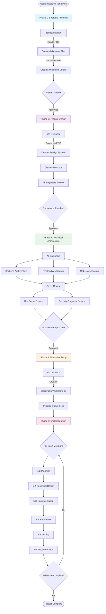
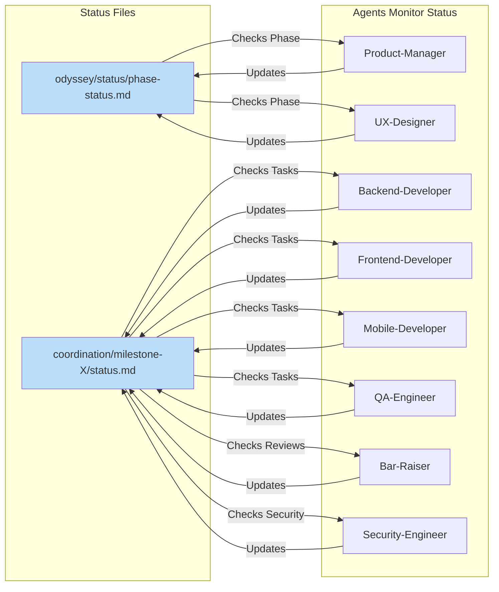
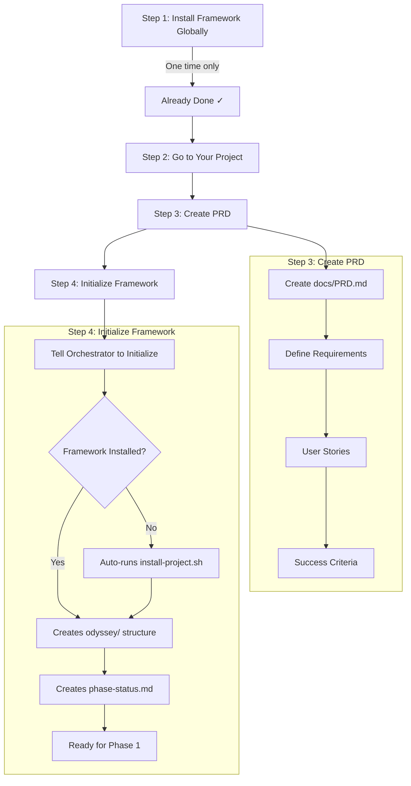

# Claude Code Custom Agents with Orchestration Framework

This repository contains custom agents for Claude Code that work together using a 5-phase orchestration framework for agent-led software development.

## Installation

### One-Time Setup
✅ **Already Complete!** Everything has been installed to `~/.claude/`

If you ever need to reinstall or update:
```bash
~/.claude/orchestration/scripts/install-global.sh
```

### Using in Projects
After the one-time setup, just tell the Orchestrator to initialize any project:

```bash
# In any project directory
"Orchestrator, initialize the orchestration framework"
```

The Orchestrator will:
1. Check if framework is installed in the project
2. If not, automatically run `~/.claude/orchestration/scripts/install-project.sh`
3. Set up the odyssey/ directory structure
4. Create phase status tracking
5. Guide you through the 5-phase process

**No manual installation needed after the initial setup!**

### Option 2: Manual Installation

#### Global Installation (All Projects)
```bash
# Copy everything to ~/.claude/
mkdir -p ~/.claude/agents
mkdir -p ~/.claude/orchestration/{scripts,templates}
cp agents/*.md ~/.claude/agents/
cp ORCHESTRATION_FRAMEWORK.md ORCHESTRATION_QUICK_REFERENCE.md PRACTICAL_USAGE_GUIDE.md ~/.claude/orchestration/
cp templates/*.md ~/.claude/orchestration/templates/
cp scripts/*.sh ~/.claude/orchestration/scripts/
chmod +x ~/.claude/orchestration/scripts/*.sh
```

#### Project-Specific Installation
```bash
# Copy to current project's .claude/
mkdir -p .claude/agents
mkdir -p .claude/orchestration/{scripts,templates}
cp agents/*.md .claude/agents/
cp ORCHESTRATION_FRAMEWORK.md ORCHESTRATION_QUICK_REFERENCE.md PRACTICAL_USAGE_GUIDE.md .claude/orchestration/
cp templates/*.md .claude/orchestration/templates/
```

### Using the Orchestrator in New Projects

When the Orchestrator starts work in a new repository, it will:
1. Check if the framework is installed locally or globally
2. If not installed, run the appropriate install script:
   - `~/.claude/scripts/install-project.sh` for project-specific setup
   - `~/.claude/scripts/install-global.sh` for global setup (if not done)

The orchestration framework is now organized under `~/.claude/orchestration/`:
- Framework docs: `~/.claude/orchestration/*.md`
- Scripts: `~/.claude/orchestration/scripts/`
- Templates: `~/.claude/orchestration/templates/`
- Agents stay in: `~/.claude/agents/` (standard location)

## How Orchestration Works

### 1. Orchestration Workflow



### 2. Status-Driven Pull Model



### 3. How to Set Up Orchestrator



### 4. Code Setup Example

```bash
# 1. Create a new project
mkdir my-awesome-project
cd my-awesome-project

# 2. Create your PRD
mkdir docs
cat > docs/PRD.md << 'EOF'
# Product Requirements Document

## Project Overview
Building an e-commerce platform...

## User Stories
- As a user, I want to browse products
- As a user, I want to add items to cart
- As a user, I want to checkout securely

## Success Criteria
- Page load time < 3s
- 99.9% uptime
- Mobile responsive
EOF

# 3. Initialize the framework
# Tell Claude: "Orchestrator, initialize the orchestration framework"
# The Orchestrator will:
# - Check if framework is installed locally
# - If not, run ~/.claude/orchestration/scripts/install-project.sh
# - Create odyssey/ directory structure
# - Set up phase tracking

# 4. Start Phase 1
# Tell Claude: "Product-Manager, check phase status and begin work"
# Product-Manager will create milestone plan

# 5. Progress through phases
# Each agent monitors status files and works when ready
# Tell Claude: "Show me odyssey/status/phase-status.md" to check progress
```

See `ORCHESTRATION_FRAMEWORK.md` for detailed phase descriptions and `PRACTICAL_USAGE_GUIDE.md` for step-by-step usage.

## Available Agents

### Orchestration
- **Orchestrator**: Framework initialization, milestone setup, and status monitoring

### Development Team
- **Backend-Developer**: Expert backend development with comprehensive DevOps capabilities (staff engineer, 15+ YOE)
- **Frontend-Developer**: Expert frontend development with deployment capabilities (staff engineer, 15+ YOE)
- **Mobile-Developer**: iOS and Android development with release automation (staff engineer, 15+ YOE)
- **Data-Engineer**: Data pipelines, warehousing, and analytics infrastructure (staff engineer, 15+ YOE)
- **Data-Scientist**: ML/AI expertise with educational transparency (staff data scientist, 15+ YOE)

### Security & Compliance
- **Security-Engineer**: Enterprise security auditing and vulnerability assessment

### Quality & Testing
- **QA-Engineer**: Test automation, performance testing, and quality assurance (staff engineer, 15+ YOE)
- **Bar-Raiser**: Principal-level technical review for designs and code (principal engineer, 20+ YOE)

### Product & Design
- **Product-Manager**: PRD writing and development planning (staff PM, 15+ YOE)
- **UX-Designer**: UI/UX design and frontend architecture assistance

### Content & Documentation
- **Content-Writer**: Content writing assistance

## Key Framework Features

This repository includes a comprehensive orchestration framework for managing complex multi-agent projects:

### Key Features
- **Milestone-Based**: Break large projects into 2-4 week milestones
- **Microservice Architecture**: Independent services for parallel development
- **Review Gates**: Every phase has quality checkpoints
- **Cross-Functional Reviews**: Engineers review each other's work
- **Comprehensive Testing**: Unit tests by developers, E2E tests by QA

### Documentation
- [ORCHESTRATION_FRAMEWORK.md](ORCHESTRATION_FRAMEWORK.md) - Complete framework guide
- [ORCHESTRATION_QUICK_REFERENCE.md](ORCHESTRATION_QUICK_REFERENCE.md) - Quick command reference
- [PRACTICAL_USAGE_GUIDE.md](PRACTICAL_USAGE_GUIDE.md) - Step-by-step usage instructions

## Usage

Once installed, Claude Code will automatically detect and use these agents when appropriate for your tasks.

### Quick Start with Pull Model
```bash
# 1. Initialize framework
"Orchestrator, initialize framework for my [project type] project"

# 2. Create PRD
"Create a PRD for [your project description]"
"Save that to docs/PRD.md"

# 3. Start Phase 1
"Product-Manager, check phase status and begin work"

# 4. Agents work autonomously
# Just check status and activate agents when needed:
"Show me odyssey/status/phase-status.md"
"All engineers, check phase status for your tasks"
```

**Key Insight**: Agents monitor status files and work when it's their turn. You don't manually coordinate - the framework does it for you!